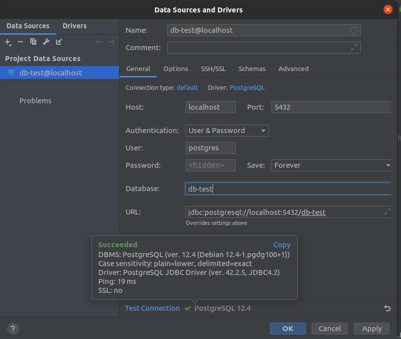

#Poc: API To-do List

## Para subir imagem do Postgres no Docker
```sh
docker run --name my-postgres -e POSTGRES_PASSWORD=secret -e POSTGRES_DB=db-test -p 5432:5432 -d postgres:12.4
```

- usuário: postgres
- senha: secret
- porta: 5432
- database: db-test




## Micronaut 2.5.11 Documentation

- [User Guide](https://docs.micronaut.io/2.5.11/guide/index.html)
- [API Reference](https://docs.micronaut.io/2.5.11/api/index.html)
- [Configuration Reference](https://docs.micronaut.io/2.5.11/guide/configurationreference.html)
- [Micronaut Guides](https://guides.micronaut.io/index.html)
---

## Feature http-client documentation

- [Micronaut HTTP Client documentation](https://docs.micronaut.io/latest/guide/index.html#httpClient)

## Feature jdbc-hikari documentation

- [Micronaut Hikari JDBC Connection Pool documentation](https://micronaut-projects.github.io/micronaut-sql/latest/guide/index.html#jdbc)

## Feature lombok documentation

- [Micronaut Project Lombok documentation](https://docs.micronaut.io/latest/guide/index.html#lombok)

- [https://projectlombok.org/features/all](https://projectlombok.org/features/all)

